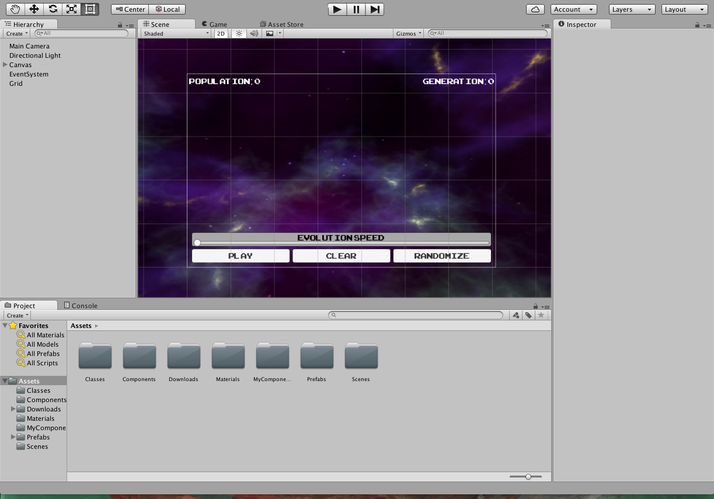
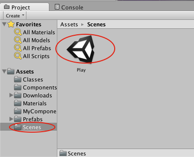
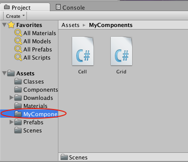
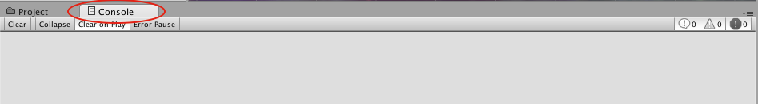
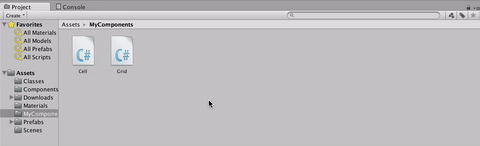
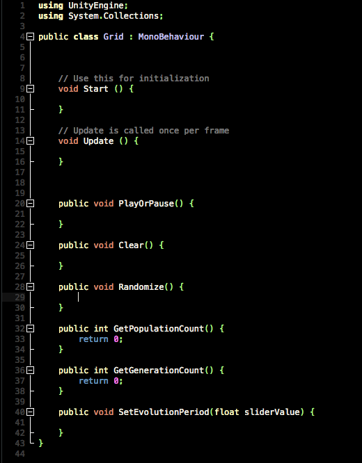

In this tutorial you are going to familiarize yourself with C\# by
making both a 2D and 3D version of Conway's Game of Life in Unity. If
you've never heard of Conway's Game of Life,
[*Wikipedia*](http://en.wikipedia.org/wiki/Conway%27s_Game_of_Life) has
a great article. Nearly every programmer has written a version of this
game at some point in their careers and wasted lots of time staring at
cool shapes morphing. Consider this your initiation :p

TL;DR
=====

There is a grid of cells. A cell is either alive or dead. If a cell has
less than two live neighbors, it dies. If it has more than three
neighbors, it dies. If a live cell has exactly two or three neighbors,
it stays alive and if a dead cell has exactly three neighbors, it comes
to life.

Try placing a few live cells and then hitting the next button to run one
round. The Wikipedia article has some great examples of common patterns
that produce cool effects. Press the animate button to continuously run
the game. Play around with it a little and come back when you're ready.

You can check it out
[*here*](https://jsfiddle.net/makeschool_dion/zose7rv3/embedded/result/).

In order to focus on C\# rather than Unity, we’ve created a base project
that has visual pieces hooked into some code. *We’re* going to be
implementing the code that makes the game work!

Download and open the GOL Project in Unity. You should see some HUD
floating over a nebulous space.

If you do not see this, navigate in the Project Panel at the bottom or
bottom-left to Scenes, and open the Scene named Play by double-clicking
it.

The scripts we’ll be modifying are in the folder labeled MyComponents.
Click on MyComponents to open it in the Project Panel.

Grid and Cell are C\# scripts that are already hooked into our game.
Grid will be responsible for making a grid of Cells, and updating their
states based on the rules of the Game of Life.

By the way, for the majority of this tutorial, we recommend selecting
the Console tab at the bottom of the screen to hide the Project Panel
and show the Console, or dragging the Console tab to the bottom of your
screen so that both are visible. The Console is where Unity displays
errors and warnings, and it’s a lot easier to catch them if they’re
immediately visible.

In the Project Panel, double-click Grid to open it in Visual Studios.
You’ll see a class definition, including some methods Unity declared for
us, and some we’ve already declared for you.

For those of you who love object-oriented programming, Grid inherits
from Monobehaviour. In case you’re wondering why, this is just because
of the way we’re using it in Unity. You won’t need to understand why for
this tutorial, but if you’re curious, ask staff!

The methods Start and Update are special methods in Unity. The Start
method will get called when the Grid gets loaded, and the Update method
will get called every frame. This means that we can use the Start method
to do any set-up, and the Update method to run our game logic.

The other methods are ones we’ve added and that our hook-up requires.
We’ll explain each as we get to it.