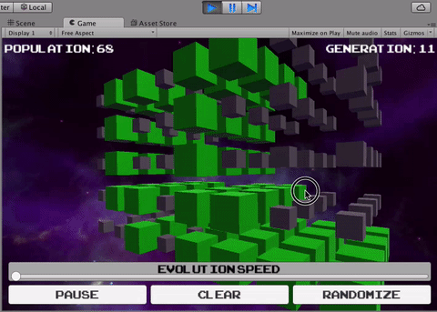

In this tutorial you are going to familiarize yourself with C# by making both a 2D and 3D version of Conway's Game of Life in Unity. If you've never heard of Conway's Game of Life, [Wikipedia](http://en.wikipedia.org/wiki/Conway%27s_Game_of_Life) has a great article. Many programmers have written a version of this game at some point in their careers and wasted lots of time staring at the cool shapes morphing. _Consider this your initiation_ 😂

### TL;DR

There's a grid of cells. A cell is either alive or dead and follows these rules:

- If a cell has less than two live neighbors, it dies
- If it has more than three neighbors, it dies
- If a live cell has exactly two or three neighbors, it stays alive
- If a dead cell has exactly three neighbors, it comes to life

You can check out an in-browser version of the [Game of Life](https://jsfiddle.net/makeschool_dion/zose7rv3/embedded/result/)

Try placing a few live cells and then hitting the next button to run one round. The Wikipedia article has some great examples of common patterns that produce cool effects. Press the animate button to continuously run the game. Play around with it a little and come back when you're ready to begin.

<!-- TODO: Add # What you will learn -->

# The finished product

We will be programming the rules for a three-dimensional grid instead of the traditional two-dimensional grid. You'll end up with something pretty great!

For this tutorial, we want to focus on C# rather than Unity. We’ve created a base project that has the visual pieces hooked into some code. Together, we’re going to be implementing the code that makes the game work!
