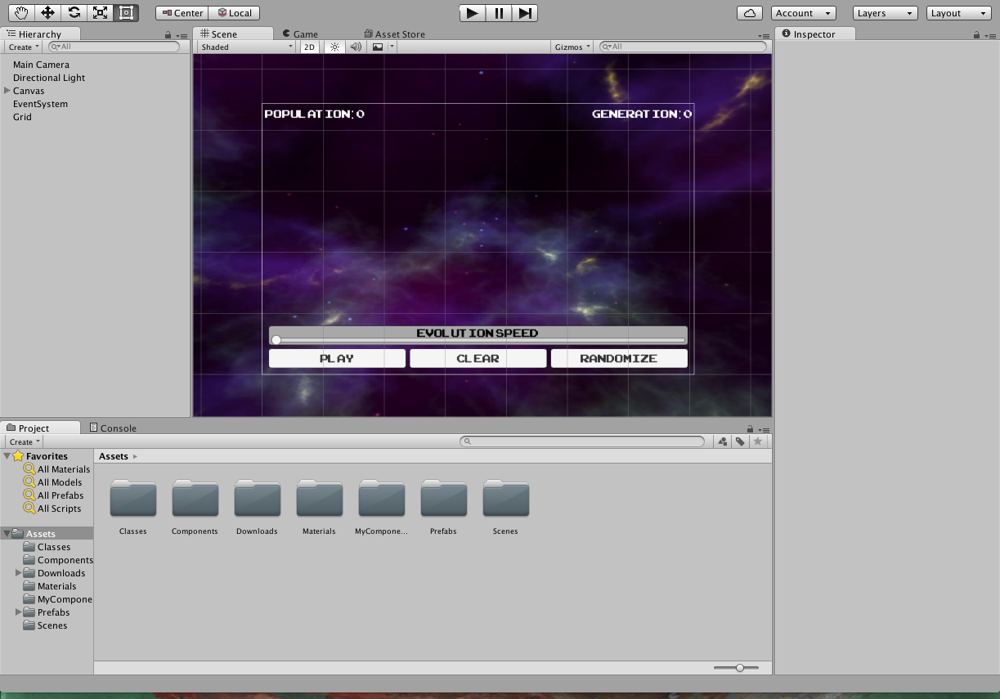
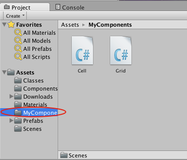
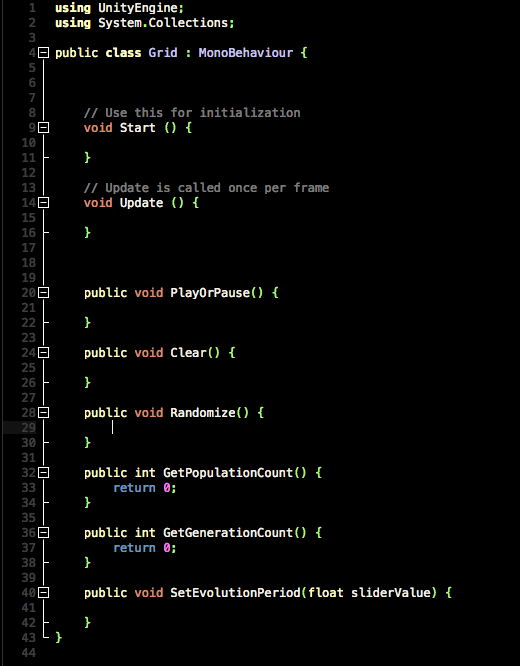
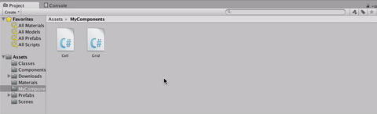

Since we're starting with a pre-made project, we need to get it on our computer! We'll use `git` to download the project. Don't worry if you have never used `git` before, we'll go more in-depth later on in the course.

> [action]
>
Open the `Command Prompt` application from your Start menu and type the following (input each line separately, and then hit `Enter` for each):
>
```
cd Desktop
git clone https://bitbucket.org/MakeSchool-Tutorials/gameoflife-unity.git
```
>
When you hit `Enter` some outputs should appear in the Command Prompt, and then a folder named `gameoflife-unity` should appear on your Desktop with a folder named `GOL` inside.
>


# Opening the project

Let's take a look at the starter project.

> [action]
>
Open Unity, and open the project by choosing `Open` and then navigating to and selecting the folder `GOL`.
>

>

>
When the project opens, you should see a _HUD_ floating over a nebulous space.
>

>
If you do not see this, navigate in the _Project Panel_ at the bottom to the _Scenes_ folder, and open the _Scene_ named _Play_ by double-clicking it.
>


# Checking out the starter code

The scripts we’ll be modifying are in the folder labeled MyComponents.

> [action]
>
Click on the MyComponents folder to open it in the Project Panel.
>


`Grid` and `Cell` are `C#` scripts that are already hooked into our game. `Grid` will be responsible for making a grid of `Cells`, and updating their states based on the rules of the Game of Life.

> [action]
>
In the Project Panel, double-click `Grid` to open it in Visual Studio.

You’ll see a class definition, including some methods Unity declared for us, and some we’ve already declared for you.



> [info]
>For those of you who love object-oriented programming, `Grid` inherits from `MonoBehaviour`. In case you’re wondering why, this is because of the way we’re using it in Unity. You won’t need to understand why for this tutorial, but if you’re curious, ask staff!

The methods `Start` and `Update` are special methods in Unity. The `Start` method will get called when the `Grid` gets loaded, and the `Update` method will get called every frame. This means that we can use the `Start` method to do any set-up, and the `Update` method to run our game logic.

The other methods are ones we’ve added and that our base project requires. We’ll explain each as we get to it.

> [info]
>
You may have noticed that the `Start` and `Update` methods
don’t have `private` or `public` in front of them. In C#, if not
specified, a method declared in a class like `Play` will be private, so `Start` and `Update` could also be:
>
```
private void Start() {
>
}
>
private void Update() {
>
}
```

<!--  -->

> [info]
>
By the way, for the majority of this tutorial, we recommend selecting the _Console_ tab at the bottom of the screen to hide the _Project Panel_ and show the _Console_. You can also drag the _Console_ tab to the bottom of your screen so that both are visible. The Console is where Unity displays errors and warnings, and it’s a lot easier to catch them if they’re readily visible.
>

>

