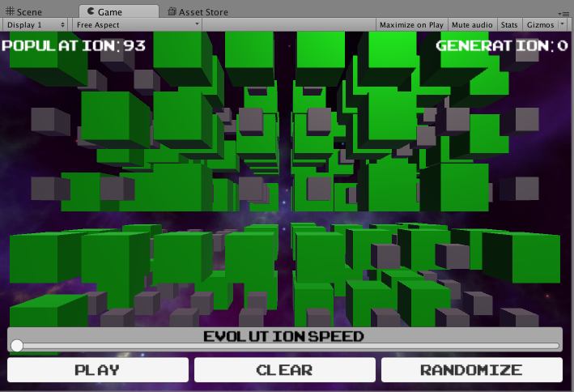

All the Dees. All three of them!

What do we need to do to make our game 3D?  We need to add a dimension, then maybe change our rules, because now a `Cell` could be surrounded by `26` Cells instead of `8`.

Let’s do it!

> [action]
>
First, change the cells member variable to allow a third dimension by
changing it to be:
>
```
private Cell[,,] cells;
```

It may look very similar to before -- we’ve added a single comma.

> [action]
>
Next, add the follow member variable:
>
```
private int numLays = 5;
```

We’re using the term "layers" to refer to this new dimension we’re adding to our grid, hence `numLays` for short.

> [action]
>
Now go ahead and add that third dimension in there!  This can be tricky, so be sure you don't forget anything!
>
As a hint for setting the position in the `Start` method, by the way, you can say:
>
```
cell.transform.localPosition = new Vector3(x,y,z);
```
>
once you find z, because `localPosition` is _really_ a `Vector3`. When we assigned from a `Vector2`, Unity was smart and filled in a `0` for that 3rd parameter.
>
**Do not worry about changing the rules yet, we'll get to that soon!**

This may take a little while, you'll have to update most of the methods in your class. We'll wait!

> [info]
>
Did you get an error when you tried to run the Scene? If so, double-click the error in the Console and it should take you to the spot in your code that made Unity sad. See if you can figure out what the issue is (a likely culprit is a missing curly brace).

# Checking your work

Hover over the solution box below to see what we did.

> [solution]
>
Our `Grid` class looks like this:
>
```
using UnityEngine;
using System.Collections;
>
public class Grid : MonoBehaviour {
>
  private int generationCount;
>
  private float evolutionPeriodMax = 1.5f;
  private float evolutionPeriodMin = 0.25f;
>
  private bool isPlaying;
>
  private int numCols = 8;
  private int numRows = 5;
  private int numLays = 4;
>
  private float cellSideLength = 1;
  private float margin = 0.5f;
>
  private Cell[,,] cells;
>
  private float evolutionPeriod = 0.5f;
  private float evolutionTimer;
>
  // Use this for initialization
  void Start () {
>
    cells = new Cell[numCols,numRows,numLays];
>
    for (int col = 0; col < numCols; ++col) {
      for (int row = 0; row < numRows; ++row) {
        for (int lay = 0; lay < numLays; ++lay) {
>
          Cell cell = Utilities.GetNewCell();
          float x = (col + 0.5f - numCols * 0.5f) * (cellSideLength + margin);
          float y = (row + 0.5f - numRows * 0.5f) * (cellSideLength + margin);
          float z = (lay + 0.5f - numLays * 0.5f) * (cellSideLength + margin);
          cell.transform.localPosition = new Vector3(x,y,z);
>
          cells[col,row,lay] = cell;
        }
      }
    }
>
  }
>
  // Update is called once per frame
  void Update () {
>
    evolutionTimer -= Time.deltaTime;
    if (evolutionTimer < 0) {
>
      evolutionTimer = evolutionPeriod;
>
      Evolve();
    }
  }
>
  private void Evolve() {
>
    foreach (Cell cell in cells) {
      cell.UpdateIsAlive();
    }
>
    if (isPlaying) {
>
      ++generationCount;
>
      for (int col = 0; col < cells.GetLength(0); ++col) {
        for (int row = 0; row < cells.GetLength(1); ++row) {
          for (int lay = 0; lay < cells.GetLength(2); ++lay) {
>
            int numAliveNeighbors = GetNumAliveNeighbors(col,row,lay);
>
            Cell cell = cells[col,row,lay];
>
            if (cell.IsAlive()) {
>
              if (numAliveNeighbors < 2 || numAliveNeighbors > 3) {
                cell.isAliveNext = false;
              } else {
                cell.isAliveNext = true;
              }
>
            } else if (!cell.IsAlive() && numAliveNeighbors == 3) {
              cell.isAliveNext = true;
            }
          }
>
        }
      }
    }
>
  }
>
  private int GetNumAliveNeighbors(int colCenter, int rowCenter, int layCenter) {
>
    int numAliveNeighbors = 0;
>
    for (int dCol = -1; dCol <= 1; ++dCol) {
      for (int dRow = -1; dRow <= 1; ++dRow) {
        for (int dLay = -1; dLay <= 1; ++dLay) {
>
          if (dCol == 0 && dRow == 0 && dLay == 0) {continue;}
>
          int col = colCenter + dCol;
          int row = rowCenter + dRow;
          int lay = layCenter +dLay;
>
          if (col < 0) {col = cells.GetLength(0) - 1;}
          if (col >= cells.GetLength(0)) {col = 0;}
>
          if (row < 0) {row = cells.GetLength(1) - 1;}
          if (row >= cells.GetLength(1)) {row = 0;}
>
          if (lay < 0) {lay = cells.GetLength(2) - 1;}
          if (lay >= cells.GetLength(2)) {lay = 0;}
>
          if (cells[col,row,lay].IsAlive()) {
            ++numAliveNeighbors;
          }
        }
>
      }
    }
>
    return numAliveNeighbors;
  }
>
  private void ResetEvolutionTimer() {
    evolutionTimer = 0;
  }
>
  public void PlayOrPause() {
>
    ResetEvolutionTimer();
>
    isPlaying = !isPlaying;
  }
>
  public void Clear() {
>
    ResetEvolutionTimer();
    generationCount = 0;
>
    foreach (Cell cell in cells) {
      cell.isAliveNext = false;
    }
  }
>
  public void Randomize() {
>
    ResetEvolutionTimer();
    generationCount = 0;
>
    foreach (Cell cell in cells) {
      cell.isAliveNext = Random.value < 0.5f;
    }
  }
>
  public int GetPopulationCount() {
>
    int populationCount = 0;
>
    foreach (Cell cell in cells) {
      if (cell.IsAlive()) {
        ++populationCount;
      }
    }
>
    return populationCount;
  }
>
  public int GetGenerationCount() {
    return generationCount;
  }
>
  public void SetEvolutionPeriod(float sliderValue) {
    evolutionPeriod = Mathf.Lerp(evolutionPeriodMin,evolutionPeriodMax,1.0f - sliderValue);
  }
}
>
```

All right. You’ve made a lot of changes. Take a deep breath.

Save the component, run the Scene, and hit Randomize.


