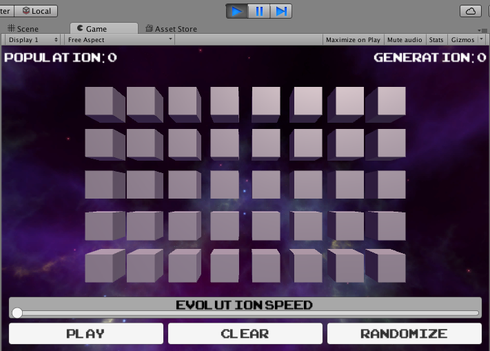

#Code

You may have noticed, by the way, that the Start and Update methods
don’t have “private” or “public” in front of them. In C\#, if not
specified, a method declared in a class like Play will be private, so
Start and Update could also have been written like this:

```
private void Start() {

}

private void Update() {

}
```

The first thing we’ll want to do is set up our grid.

Right above the declaration of the Start method, declare the following
private member variables:

```
private int numCols = 8;
private int numRows = 5;
private float cellSideLength = 1;
private float margin = 0.5f;
```

“numCols” and “numRows” will be used to define how wide and tall our
grid is, respectively. “cellSideLength” represents how long each side of
our cell will be. We’ll be using cubes as cells, which, in Unity have a
side length of 1, so we’ve set this to 1. The variable “margin” will be
used to give us a little breathing room between cells, so we can see
everything better.

The “f” at the end of “0.5” in margin’s declaration tells the compiler
that this number is a float rather than a double; without that, C\# will
treat 0.5 as a double, and get sad because it doesn’t implicitly cast
doubles to floats. It does, however, implicitly cast ints to floats, as
you can see in cellSideLength’s declaration. Why is this? Well, a float
has more information than an int, but less information than a double, so
C\# wants to make sure you really mean to lose that information.

We’ve defined the values for these member variables inline, which is
totally allowed in C\#! Variables that aren’t set explicitly default to
0 or null.

Next change the Start method to look like this:

```
void Start() {
for (int col = 0; col < numCols; ++col) {
  for (int row = 0; row < numRows; ++row) {
      Cell cell = Utilities.GetNewCell();
      float x = (col + 0.5f - numCols * 0.5f) * (cellSideLength + margin);
      float y = (row + 0.5f - numRows * 0.5f) * (cellSideLength + margin);
      cell.transform.localPosition = new Vector2(x,y);
      }
    }
}
```

We’ll explain this code in a moment, but first, let’s see it in action.

Save the component, and go back to Unity.

Press the Play arrow at the **top** to run the Scene. You should see a
grid of cubes appear!




Press the Play button up top again to stop running the Scene.

As you’ve probably guessed, our code creates a cube for each cell in our
grid, and positions each one based on the row and column.

To explain the math a little, we’ve turned columns in our grid into x
values in space, and rows in our grid into y values in space. In order
to do this, we needed to account for the fact that (0,0) is at the
center of our screen and that Unity positions cubes by putting the
center of them at the point you say. That means that a cube at (0,0)
will appear with its center at the center of the screen, so if we said
something like:

```
float x = col * (cellSideLength + margin);
float y = row * (cellSideLength + margin);
```

our the cube at column 0, row 0 would appear in the center of our
screen, but if we want our whole grid to be centered, we want this cube
to be offset by half the grid’s width and height.

We can do that by writing:

```
float x = (col - numCols * 0.5f) * (cellSideLength + margin);
float y = (row - numRows * 0.5f) * (cellSideLength + margin);
```

which moves the center of our cube down and to the left. However, this
moves our cube too far, because it positions the center of the cube
where the lower left-hand corner of our grid should be. Really, we want
the lower left-hand corner of the cube to be where the lower left-hand
corner of our grid is. To fix this, we want to move our cube up and to
the right by half of whatever it’s height and width is, so we write:

```
float x = (col + 0.5f - numCols * 0.5f) * (cellSideLength + margin);
float y = (row + 0.5f - numRows * 0.5f) * (cellSideLength + margin);
```
