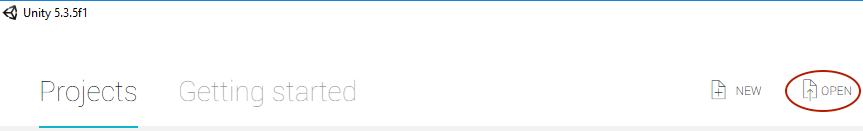
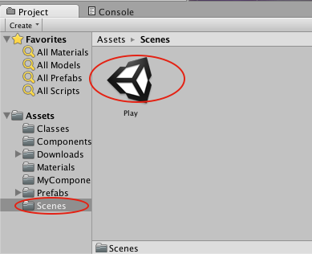
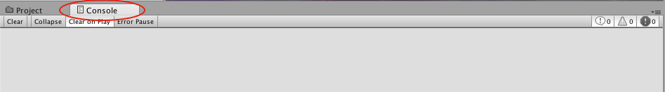

>[action]
>
>Open the Command Prompt application from your Start menu and type the following (input each line separately, and then hit "Enter" for each):
>
>```
>cd Desktop
>git clone https://bitbucket.org/MakeSchool-Tutorials/gameoflife-unity.git
>```

When you hit "Enter" some stuff should appear in the Command Prompt, and then a folder named "gameoflife-unity" should appear on your Desktop with a folder named "GOL" inside.


>[action]
> Open Unity, and open the project by choosing "Open," and then navigating to and selecting the folder "GOL."




When the project opens, you should see some HUD floating over a nebulous space.


If you do not see this, navigate in the Project Panel at the bottom to the Scenes folder, and open the Scene named Play by double-clicking it.



The scripts we’ll be modifying are in the folder labeled MyComponents.

>[action]
>Click on the MyComponents folder to open it in the Project Panel.


Grid and Cell are C\# scripts that are already hooked into our game. Grid will be responsible for making a grid of Cells, and updating their states based on the rules of the Game of Life.

>[action]
>In the Project Panel, double-click Grid to open it in Visual Studios.

You’ll see a class definition, including some methods Unity declared for us, and some we’ve already declared for you.


>[info]
>For those of you who love object-oriented programming, Grid inherits from Monobehaviour. In case you’re wondering why, this is just because of the way we’re using it in Unity. You won’t need to understand why for this tutorial, but if you’re curious, ask staff!

The methods Start and Update are special methods in Unity. The Start method will get called when the Grid gets loaded, and the Update method will get called every frame. This means that we can use the Start method to do any set-up, and the Update method to run our game logic.

The other methods are ones we’ve added and that our hook-up requires. We’ll explain each as we get to it.

>[info]
>You may have noticed that the Start and Update methods
don’t have “private” or “public” in front of them. In C\#, if not
specified, a method declared in a class like Play will be private, so
Start and Update could also have been written like this:
>
```
private void Start() {
>
}
>
private void Update() {
>
}
```

By the way, for the majority of this tutorial, we recommend selecting the Console tab at the bottom of the screen to hide the Project Panel and show the Console, or dragging the Console tab to the bottom of your screen so that both are visible. The Console is where Unity displays errors and warnings, and it’s a lot easier to catch them if they’re
immediately visible.




