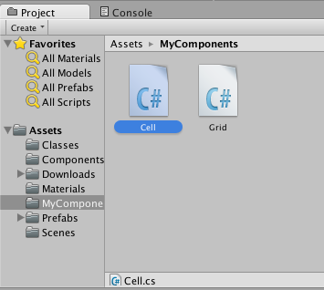
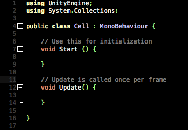
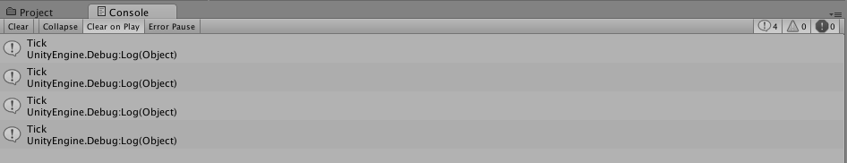
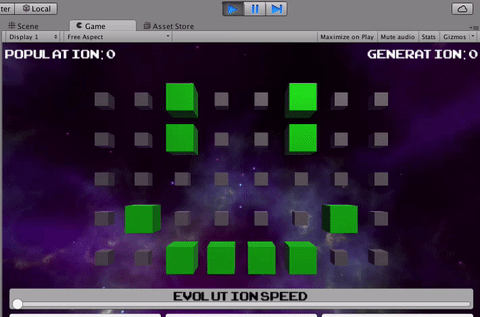

#Cells
What is Cell?

Navigate to and double-click MyComponents/Cell to open it in Visual
Studio.



When you do, you should see some code similar to Grid.



In Grid, we set Cell’s position by setting cell.transform.localPosition.
“transform” is a public property that Cell has inherited from
MonoBehaviour, and localPosition is a property of that.

We’ve positioned Cell by assigning its transform’s localPosition, which
is a Vector, to a new Vector. The “new” keyword is the C\# way of saying
that a new object is being instantiated.

The function Utilites.GetNewCell(), by the way, is a method we’ve
written to handle generating the Cube using a predefined Unity object,
also known as a Prefab. We’ve written a few Utilities functions to
handle some tasks that are Unity-specific and/or specific to how we’ve
set up this project. You can treat these functions as a black-box for
this tutorial, but if you are interested in peeking inside, Utilities is
located in the Classes folder.

Now that we have an arrangement of Cells, let’s make them alive or dead!

Open up Grid again, and declare another private member variable:

```
private Cell[,] cells;
```

This is a special type of array in C\# called a multidimensional array.
A cell in cells can then be accessed like cells\[col,row\] or by
iterating using a foreach loop, both of which we’ll eventually use.

Add the following before the for loops in the Start method:

```
cells = new Cell[numCols,numRows];
```

This line initializes our array of cells. You may be wondering why we
didn’t do this inline like the rest of our member variable declarations.
We couldn’t do this because we wanted to rely on numCols and numRows,
which we cannot reference until we’re inside a method.

Add the following below the Cell instantiation inside the for loop in
Start:

```
cells[col,row] = cell;
```

Then open Cell and add the following to the Update method:

```
float scaleFactor = isAlive ? 1 : 0.5f;
transform.localScale = Vector3.one * scaleFactor;
Color color = isAlive ? Color.green : Color.grey;
Utilities.ChangeCellColor(this,color);
```

And add the following member variable to it:

```
private bool isAlive;
```

Since we’re never assigning this bool, it will always be false, because
C\# values default to 0 or null when initialized without assignment.

Save the components and run the Scene. All your Cubes should appear
smaller than before!


How have we done this? Well, our multidimensional array stores a Cell
for each spot in our grid. Each cell has an isAlive flag, which is set
to false by default.

In our Update method, we’re looking at each Cell in our array of Cells
and setting the size of the Cell (transform.localScale)l based on
whether or not that cell is alive. The property transform.localScale is
a Vector, with one component for each of the 3 spatial dimensions the
Game Object occupies. We haven’t initialized a new Vector in this case,
but instead multiplied a constant Vector of length (1,1,1) -- Vector.one
-- by a scalar to get a vector with each component scaled up.

The line:

```
float scaleFactor = isAlive ? 1.0f : 0.5f;
```

is what’s known as “syntactic sugar,” or a prettier version of, the
following:

```
float scaleFactor;

if (cell.isAlive) {
  scaleFactor = 1;
} else {
  scaleFactor = 0.5f;
}
```

Neither is any more correct than the other, one is just more concise;
however, if you prefer the longer version because it is more clear, by
all means **USE IT!** Code is meant to be readable!

You may also have noticed the “this” used in our Utility function used
to set the color. This is because the Utility function requires a
parameter of type Cell. “this” is the word C\# uses within a class to
refer to the instance itself.

But how can we be sure our code isn’t just shrinking all of our Cells
unconditionally? Let’s add some test code.

Change Cell’s isAlive method from private to public:

```
public bool isAlive;
```

Then put the following at the bottom of the Start method of Grid:

```
cells[2,3].isAlive = true;
cells[2,4].isAlive = true;
cells[5,3].isAlive = true;
cells[5,4].isAlive = true;
cells[1,1].isAlive = true;
cells[6,1].isAlive = true;
cells[2,0].isAlive = true;
cells[3,0].isAlive = true;
cells[4,0].isAlive = true;
cells[5,0].isAlive = true;
```

When you save and run this, you should see this totally arbitrary and
entirely randomly-chosen pattern appear:


Now that we’re convinced our grid appropriately displays Cells as small
or big to show whether or not they’re dead or alive, let’s add the logic
that will make our population of cells evolve!

First, we’ll need to set an evolution speed. We won’t hook it up to our
UI just yet; we want it to work first, then be interactive, so we’ll
pick a default value.

Add the following member variables to Grid:

```
private float evolutionPeriod = 0.5f;
private float evolutionTimer;
```

Then add the following to the Update method:

```
 evolutionTimer -= Time.deltaTime;
 if (evolutionTimer < 0) {
 evolutionTimer = evolutionPeriod;
 Debug.Log("Tick");
 }
```

Save the components, run the Scene, and look in the Console. You should
see “Tick” logged every half-second.



What we’ve done here is create a very simple timer. The variable
evolutionTimer starts out at 0, and every frame, we subtract from it the
amount of time that passed between this frame and the previous one
(Time.deltaTime).

Whenever evolutionTimer becomes negative, we bring it back up to the
value of the period we want for our timer.

Time.deltaTime, by the way, is not necessarily a constant; even if we’re
running at, say, 60 frames-per-second, we have no guarantee that each
frame will take exactly 1/60th of a second to process! If a frame takes,
say, 10 seconds to process, our timer won’t give us 20 ticks, but that’s
okay. The user will see at most the next tick, no matter how long a
cycle takes.

In order to update the grid, we’ll need to add the rules to the Game of
Life where this “Tick” is being logged.

In order to ensure that the values of cells that have already been
calculated don’t affect cells that haven’t yet been calculated, we’re
going to make our Cells evolve in two steps.

First, we’re going to calculate the state that each cell should have on
the next frame.

Then, we’re going to assign each cell to have the correct state.

Create a two new member variables in Cell:

```
 private bool isAliveNext;
 private bool _isAlive;
```

Note the underscore; this is just to prevent a name collision with
isAlive.

Then change the member variable isAlive to look like the following:

```
 public bool isAlive {

 set {
 isAliveNext = value;
 }

 get {
 return _isAlive;
 }
}
```

This funny notation here is C\#’s getter/setter notation. The “get”
value is returned when you attempt to retrieve the value of the property
isAlive, and the “set” method is called when you assign a value (held in
the variable named “value”) to isAlive.

Add the following method to Cell:
```
 public void UpdateIsAlive() {
 	_isAlive = isAliveNext;
 }

//Now open Grid. Create a new method in Grid called Evolve:

 	private void Evolve() {
	}
```
And replace the Debug.Log(“Tick”) line with:

```
 Evolve();
```
Inside Evolve, add the following code:
```
for (int col = 0; col < cells.GetLength(0); ++col) {
for (int row = 0; row < cells.GetLength(1); ++row) {

	int numAliveNeighbors = GetNumAliveNeighbors(col,row);

	Cell cell = cells[col,row];

	if (cell.isAlive) {

		if (numAliveNeighbors < 2 || numAliveNeighbors > 3) {
			cell.isAlive = false;
		} else {
			cell.isAlive = true;
		}
	} else if (!cell.isAlive && numAliveNeighbors == 3) {
	cell.isAlive = true;
		}
	}
}

foreach (Cell cell in cells) {
	cell.UpdateIsAlive();
}
```

Then create a new method in Grid called GetNumAliveNeigbors with the
following definition:

 ```
 private int GetNumAliveNeighbors(int colCenter, int rowCenter) {
int numAliveNeighbors = 0;

for (int dCol = -1; dCol <= 1; ++dCol) {
 for (int dRow = -1; dRow <= 1; ++dRow) {

if (dCol == 0 && dRow == 0) {continue;}

int col = colCenter + dCol;
int row = rowCenter + dRow;

if (col < 0 || col >= cells.GetLength(0) ||
row < 0 || row >= cells.GetLength(1)) {
continue;
}

if (cells[col,row].isAlive) {
++numAliveNeighbors;
}
}
}

return numAliveNeighbors;
}
```

Save everything, then run the Scene!


For an easier-to-recognize pattern, you could also use a simple 3-pixel
oscillator instead:


Our GetNumAliveNeighbors method looks one row and one column around a
given cell to see if the cell at that location is alive or not. If it
is, it adds it to the count.

The lines:

```
if (col < 0 || col >= cells.GetLength(0) ||
row < 0 || row >= cells.GetLength(1)) {
continue;
}
```

prevent the check from going out of bounds in the case that the Cell is
at the edge of our grid (like (0,0), for example).

But… why not wrap around instead? Then gliders could propagate forever!

Replace those lines with the following:

```
if (col < 0) {col = cells.GetLength(0) - 1;}
if (col >= cells.GetLength(0)) {col = 0;}

if (row < 0) {row = cells.GetLength(1) - 1;}
if (row >= cells.GetLength(1)) {row = 0;}
```



If you want to test this with a glider, try the coordinates (2,3),
(3,2), (4,2), (4,3), and (4,4):


Now that our Game of Life runs, let’s add the UI.
