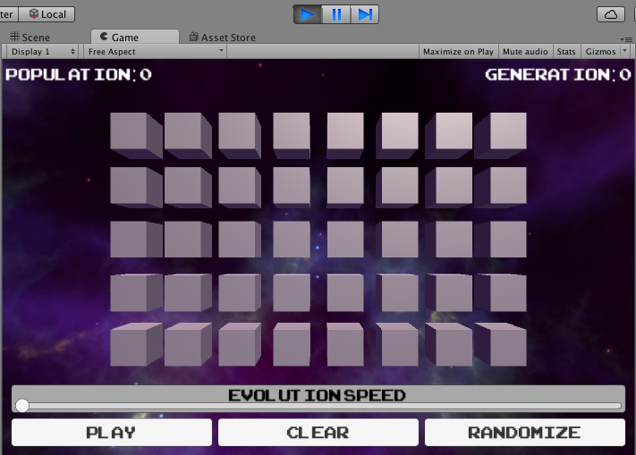
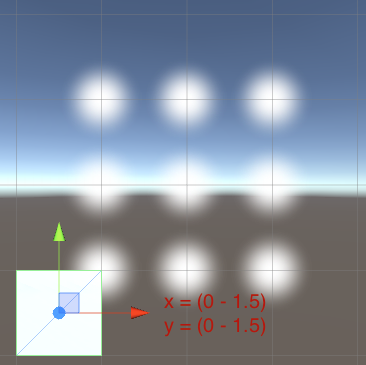

The first thing we’ll want to do is set up our grid.

>[action]
>Right above the declaration of the Start method, declare the following private member variables:
>
>```
>private int numCols = 8;
>private int numRows = 5;
>private float cellSideLength = 1;
>private float margin = 0.5f;
>```

“numCols” and “numRows” will be used to define how wide and tall our grid is, respectively. “cellSideLength” represents how long each side of our cell will be. We’ll be using cubes as cells, which, in Unity have a side length of 1, so we’ve set this to 1. The variable “margin” will be used to give us a little breathing room between cells, so we can see everything better.

The “f” at the end of “0.5” in margin’s declaration tells the compiler that this number is a float rather than a double; without that, C\# will treat 0.5 as a double, and get sad because it doesn’t implicitly cast doubles to floats. It does, however, implicitly cast ints to floats, as you can see in cellSideLength’s declaration. Why is this? Well, a float has more information than an int, but less information than a double, so C\# wants to make sure you really mean to lose that information.

We’ve defined the values for these member variables inline, which is totally allowed in C\#! Variables that aren’t set explicitly default to 0 or null.

>[action]
>Next change the Start method to look like this:
>
>```
>void Start() {
>for (int col = 0; col < numCols; ++col) {
>  for (int row = 0; row < numRows; ++row) {
>      Cell cell = Utilities.GetNewCell();
>      float x = (col + 0.5f - numCols * 0.5f) * (cellSideLength + margin);
>      float y = (row + 0.5f - numRows * 0.5f) * (cellSideLength + margin);
>      cell.transform.localPosition = new Vector2(x,y);
>      }
>    }
>}
>```

You may see what this code does already, but before we go over it, let’s see it in action.

Save the component, and go back to Unity.

>[action]
>Press the Play arrow at the **top** to run the Scene. You should see a
grid of cubes appear!




>[action]
>Press the Play button up top again to stop running the Scene.

As you’ve may have suspected, our code creates a cube for each cell in our grid, and positions each one based on the row and column.

To explain the positioning math a little, we’ve turned columns in our grid into x values in space, and rows in our grid into y values in space. In order to do this, we needed to account for the fact that (0,0) is at the center of our screen and that Unity positions cubes by putting the center of them at the point you say. That means that a cube at (0,0) will appear with its center at the center of the screen.

If we had said something like:

```
float x = col * (cellSideLength + margin);
float y = row * (cellSideLength + margin);
```

then our the cube at column 0, row 0 would have appeared in the center of our screen. (To make the math easier, we're making cellSideLength + margin equal 1)


However, we want our *whole grid* to be centered. That means we want the cube at column 0, row 0 to be offset by half the grid’s width and half the grid's height.


We can do that by writing:

```
float x = (col - numCols * 0.5f) * (cellSideLength + margin);
float y = (row - numRows * 0.5f) * (cellSideLength + margin);
```

which moves the center of our cube down and to the left.



However, this moves our cube too far, because it positions the center of the cube where the lower left-hand corner of our grid should be. Really, we want the lower left-hand corner of the cube to be where the lower left-hand corner of our grid is.


To fix this, we want to move our cube up and to the right by half of whatever it’s height and width is, so we write:

```
float x = (col + 0.5f - numCols * 0.5f) * (cellSideLength + margin);
float y = (row + 0.5f - numRows * 0.5f) * (cellSideLength + margin);
```

Note that these calculations have been done totally independently of how big the cube is!  This is good, because it means if we ever wanted to change the Cube's size, we'd just need to change cellSideLength to match the new size of the cube we make ;)

The last part of this code you may be wondering about is "Cell." What is Cell?

>[action]
>Navigate to and double-click MyComponents/Cell to open it in Visual
Studio.


When you do, you should see some code similar to Grid.


In Grid, we set Cell’s position by setting cell.transform.localPosition. “transform” is a public property that Cell has inherited from MonoBehaviour, and localPosition is a property of that.

We’ve positioned Cell by assigning its transform’s localPosition, which is a Vector, to a new Vector. The “new” keyword is the C\# way of saying that a new object is being instantiated.

The function Utilites.GetNewCell(), by the way, is a method we’ve written to handle generating the Cube using a predefined Unity object, also known as a Prefab. We’ve written a few Utilities functions to handle some tasks that are Unity-specific and/or specific to how we’ve set up this project. You can treat these functions as a black-box for this tutorial, but if you are interested in peeking inside, Utilities is located in the Classes folder.
