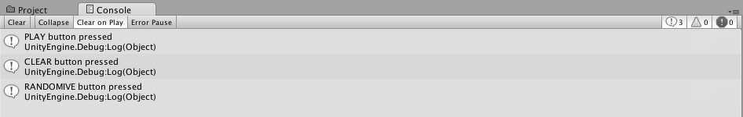
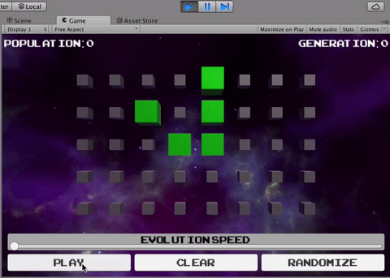
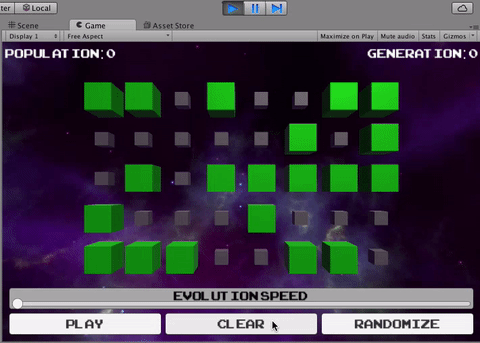
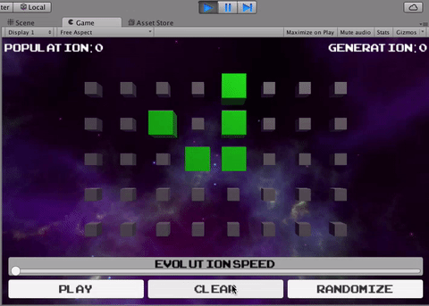
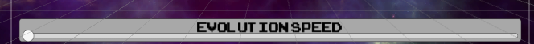
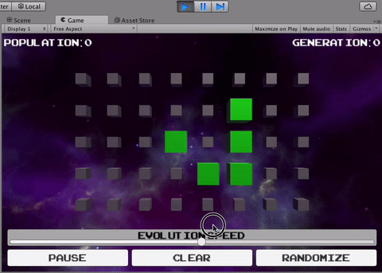
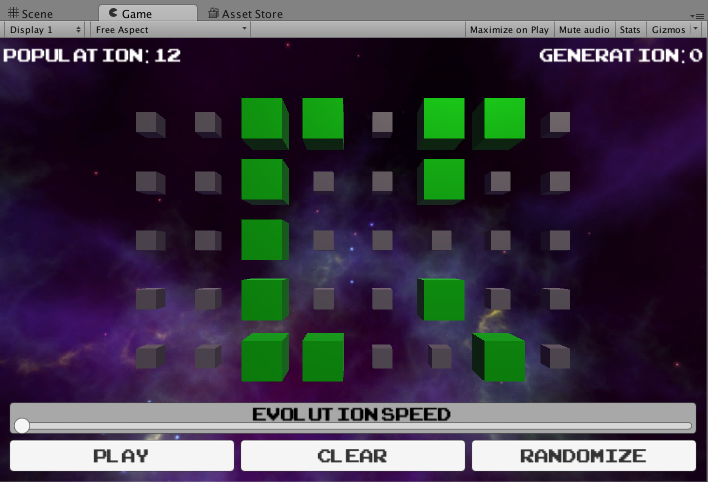
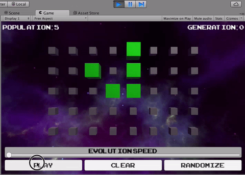

#UI
We’ll start with the buttons along the bottom.


We’ve hooked up these buttons to call some of the public methods we’ve
defined in Grid. Those are:

-   PlayOrPause
-   Clear
-   Randomize

If you’d like to verify that they’re hooked up as expected, feel free to
add a unique Debug.Log statement to each one and test them out.



To give you an idea of what these buttons should eventually do:
PlayOrPause should make our simulation play if it isn’t already, and
pause it otherwise; Clear should clear out our grid;Randomize should
fill our grid with a random population.

We’ll begin with PlayOrPause.

In Grid, add a new member variable, which we’ll use as a flag to tell
whether or not we’re playing currently:

 private bool isPlaying;

In the PlayOrPause method, add the following code:

 isPlaying = !isPlaying;

Now put the for loops that set your Cells’ life states into the
following conditional:

 if (isPlaying) {

 }

Save the components and run the Scene, and now the simulation should
only run once you hit “Play.” The simulation should stop when you hit
“Pause.”



Next we’ll implement Clear and Randomize.

Put the following into the Clear method:

```
 foreach (Cell cell in cells) {
   cell.isAlive = false;
 }
```

And put the following into the Randomize method:
```
 foreach (Cell cell in cells) {
 cell.isAlive = Random.value < 0.5f;
 }
```

The Random function is a UnityEngine function. C\# also has a built in
function System.Random that’s a little different. The reason we’re not
getting a collision between UnityEngine.Random and System.Random is
because of what namespace, or set of names, we’re using. The “using”
statements at the top tell us what namespaces to use. If we were to add
“using System” at the top, then we’d need to specify UnityEngine.Random
or System.Random as the case may be.

Save components and Run the Scene!



Hmmm… Something wonky’s going on… First of all, when you press the
“Clear” and “Randomize” buttons, sometimes they don’t happen
immediately. Also, what happened when we pressed the “Play” button?? Is
our game broken???

There are two issues here. One is that we’re not resetting our timer
when we press our buttons, and we should be. The second is that our
Clear and Randomize methods are setting what values the Cells should
have on the next step, but that’s being overwritten by our Evolve
method.

To fix the first problem, Create the following method:

```
 private void ResetEvolutionTimer() {
 evolutionTimer = 0;
 }
```

Call it at the start of PlayOrPause, Clear, and Randomize.

To fix the second problem, switch the order of for loops in the Evolve
method so that it looks like this:

```
private void Evolve() {

foreach (Cell cell in cells) {
  cell.UpdateIsAlive();
}

if (isPlaying) {
  for (int col = 0; col < cells.GetLength(0); ++col) {
    for (int row = 0; row < cells.GetLength(1); ++row) {

      int numAliveNeighbors = GetNumAliveNeighbors(col,row);

      Cell cell = cells[col,row];

if (cell.isAlive) {
  if (numAliveNeighbors < 2 || numAliveNeighbors > 3) {
    cell.isAlive = false;
    } else {
      cell.isAlive = true;
    }
}
else if (!cell.isAlive && numAliveNeighbors == 3) {
  cell.isAlive = true;
}
}
}
}
}
```

Save the components and run the Scene, and you should have a pretty
happy Game of Life!



Next, we’ll add the speed slider.



The speed slider calls the Grid method SetEvolutionPeriod, and passes in
the value it currently has, which will be a value between 0 and 1 (0 on
the far left, 1 on the far right).

As speed increases, we want our period to decrease, and we’ll want our
period to have a range that’s different than 0 to 1. What we’re going to
assign our period to be some percentage of the way between a min and a
max, using a process called *linear interpolation*.

Don’t worry if that term sounds obtuse and complicated! We’re going to
use a function to take care of this for us -- and you’ll see this
function in a later tutorial too ;)

To start, lets set our min and max values.

Add the following member variables to Grid:

```
 private float evolutionPeriodMax = 1.5f;
 private float evolutionPeriodMin = 0.25f;
```

Then put the following code into SetEvolutionPeriod:

```
 evolutionPeriod =
 Mathf.Lerp(evolutionPeriodMin,evolutionPeriodMax,1.0f - sliderValue);
```

The function Mathf.Lerp returns a value that’s some percentage of the
way between the min and max its given. The percentage of the way we’re
asking it to use is 1 - sliderValue, because sliderValue *increases* as
the slider moves left-to-right from 0 to 1, and we want our our slider
to *decrease* as it moves left-to-right from 0 to 1.

Save the components and run the Scene!



The final bits of HUD we’d like activate are the counters up top. The
population counter should tell us how many Cells are alive at any given
time, and Generation should tell us how many times the system has
evolved.

These labels determine their text by getting values from
GetPopulationCount and GetGenerationCount respectively. Right now they
return 0, but let’s put in some real code.

Replace the code inside GetPopulationCount with the following:
```
 int populationCount = 0;
 foreach (Cell cell in cells) {
   if (cell.isAlive) {
   ++populationCount;
   }
}

return populationCount;
```

Save the component and run the Scene. The population number should match
the population you see on the screen. It may help to keep the simulation
paused and hit the random button over and over to check.



For the generation count, we’ll need a separate counter. Add the a new
member variable to Grid:

```
private int generationCount;
```

Then add the following inside the isPlaying conditional in Evolve:

```
++generationCount;
```

Inside Clear and Randomize, add:

```
generationCount = 0;
```

so that we reset the count every time we perform an operation that
effectively starts a new population.

Then to implement GetGenerationCount, simply return it:

```
return generationCount;
```

Save the component and run the Scene!



Congratulations! You now have a fully functional Game of Life!

But…

You know…

You know what would take it to a whole new LEVEL…?
