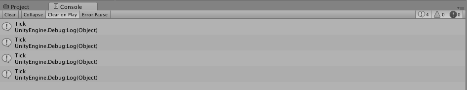
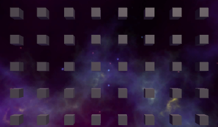
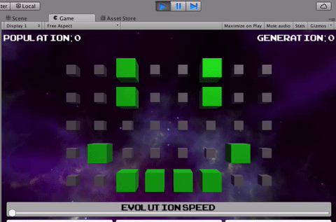
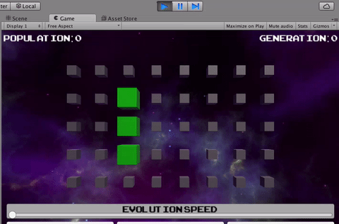
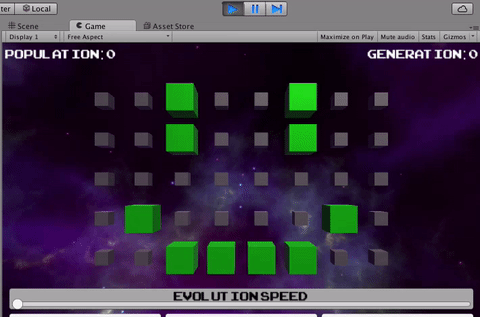
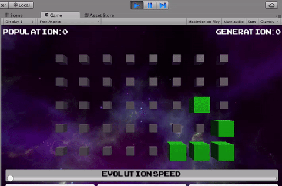

Now that we’re convinced our grid appropriately displays Cells as small or big to show whether or not they’re dead or alive, let’s add the logic that will make our population of cells evolve!

First, we’ll need to set an evolution speed. We won’t hook it up to our UI just yet; we want it to work first, then be interactive, so we’ll pick a default value for now.

>[action]
>Add two private variables to Grid, one named "evolutionPeriod," and one named "evolutionTimer."  Set evolutionPeriod to 0.5 and make them both floats.

Be sure to make sure you don't have any errors in the Console!

>[solution]
>
>Your code should look like this:
>
```
private float evolutionPeriod = 0.5f;
private float evolutionTimer;
```

<!-- -->

>Then add the following to the Update method:
>
```
evolutionTimer -= Time.deltaTime;
if (evolutionTimer < 0) {
  evolutionTimer = evolutionPeriod;
  Debug.Log("Tick");
}
```

Save the components, run the Scene, and look in the Console. You should see “Tick” logged every half-second.



What we’ve done here is create a very simple timer. The variable evolutionTimer starts out at 0, and every frame, we subtract from it the amount of time that passed between this frame and the previous one (Time.deltaTime).

Whenever evolutionTimer becomes negative, we bring it back up to the value of the period we want for our timer.

>[info]
>Time.deltaTime, by the way, is not necessarily a constant; even if we’re running at, say, 60 frames-per-second, we have no guarantee that each frame will take exactly 1/60th of a second to process! If a frame takes, say, 10 seconds to process, our timer won’t give us 20 ticks, but that’s okay. The user will see at most the next tick, no matter how long a cycle takes.

In order to update the grid, we’ll need to add the rules to the Game of Life where this “Tick” is being logged.

In order to ensure that the values of cells that have already been calculated don’t affect cells that haven’t yet been calculated, we’re going to make our Cells evolve in two steps.

First, we’re going to calculate the state that each cell should have on the next frame.

Then, we’re going to assign each cell to have the correct state.

This means we'll need to add a new public variable to Cell to track whether or not it'll be alive next.

>[action]
>Add a new public variable to Cell to track whether or not it'll be alive the next step.

<!-- -->

>[solution]
>
>Our code looks like this:
>
```
public bool isAliveNext;
```

<!-- -->
>[action]
>Now create a method you can call to update the isAlive variable to be the value of the isAliveNext variable.

<!-- -->

>[solution]
>
>Our code looks like this:
>
```
public void UpdateIsAlive() {
  isAlive = isAliveNext;
}
```
>
>Be sure it's public! Otherwise, you won't be able to call it from Grid.

To test UpdateIsAlive, let's put it into an Evolve method, which we can call every tick.

>[action]
>Create an Evolve method that you call every tick and that, for now, just calls UpdateIsAlive for each cell.

<!-- -->

>[solution]
>
>This section of our code now looks like this:
>
```
void Update () {
>
	evolutionTimer -= Time.deltaTime;
	if (evolutionTimer < 0) {
>
		evolutionTimer = evolutionPeriod;
>
		Evolve();
>
	}
}
>
private void Evolve() {
>
  foreach (Cell cell in cells) {
    cell.UpdateIsAlive();
  }
>
}
```
>
> We've chosen to use foreach rather than nesting for loops here because we don't need the rows or columns for any calculations in that step.

When you run the Scene, you should now see all the cells disappear!



We expect that this will happen, because we never set isAliveNext to anything, so it's always false, so UpdateIsAlive always sets isAlive to be false.

>[action]
>Before going on to the code to make our cells evolve, change the isAlive property to private:
>
```
private bool isAlive;
```
>
and create a method called IsAlive:
>
```
public bool IsAlive() {
  return isAlive;
}
```
>
>We only ever want to set whether or not a cell will be alive the next turn, never whether or not it is alive, but we still want to be able to get that information, so we've made the getter method IsAlive.

<!-- -->

>[action]
>When you do this, you'll also want to change the spot in the code that sets test cells to be alive to set isAliveNext instead:
>
```
cells[2,3].isAliveNext = true;
cells[2,4].isAliveNext = true;
cells[5,3].isAliveNext = true;
cells[5,4].isAliveNext = true;
cells[1,1].isAliveNext = true;
cells[6,1].isAliveNext = true;
cells[2,0].isAliveNext = true;
cells[3,0].isAliveNext = true;
cells[4,0].isAliveNext = true;
cells[5,0].isAliveNext = true;
```

Now we just need to write some code to set the isAliveNext property for each cell.

In order to do this, for each cell in our grid, we'll check the number of neighbors it has, and then check that number against the rules for the Game of Life: alive cells with 2 or 3 live neighbors live on, dead cells with 3 live neighbors come to life, and all other cells either stay or become dead.

To help you, we're written a function that calculates the number of live neighbors a cell has:

```
private int GetNumAliveNeighbors(int colCenter, int rowCenter) {

  int numAliveNeighbors = 0;

  for (int dCol = -1; dCol <= 1; ++dCol) {
    for (int dRow = -1; dRow <= 1; ++dRow) {

      if (dCol == 0 && dRow == 0) {continue;}

      int col = colCenter + dCol;
      int row = rowCenter + dRow;

      if (col < 0 || col >= cells.GetLength(0) ||
      row < 0 || row >= cells.GetLength(1)) {continue;}

      if (cells[col,row].IsAlive()) {
        ++numAliveNeighbors;
      }
    }
  }

  return numAliveNeighbors;
}
```

>[action]
>Finish the Evolve function by writing code to set isAliveNext on each cell based on neighbor count.

<!-- -->

>[solution]
>
>Our Evolve method looks like this:
>
```
private void Evolve() {
>
  for (int col = 0; col < cells.GetLength(0); ++col) {
    for (int row = 0; row < cells.GetLength(1); ++row) {
>
      int numAliveNeighbors = GetNumAliveNeighbors(col,row);
>
      Cell cell = cells[col,row];
>
      if (cell.IsAlive()) {
>
        if (numAliveNeighbors < 2 || numAliveNeighbors > 3) {
			    cell.isAliveNext = false;
        } else {
          cell.isAliveNext = true;
        }
>
      } else if (!cell.IsAlive() && numAliveNeighbors == 3) {
        cell.isAliveNext = true;
      }
    }
  }
>
  foreach (Cell cell in cells) {
    cell.UpdateIsAlive();
  }
}
```
>
>Note that we *do* use nested for loops for the GetNumAliveNeigbors logic, because that method requires column and row numbers.

<!-- -->

>[action]
>Save everything, then run the Scene!



For an easier-to-recognize pattern, you could also use a simple 3-pixel
oscillator instead:



You may have noticed that our GetNumAliveNeighbors method treats a cell in a corner as only surrounded by 3 cells, but a cell in the center as surrounded by 8. Our game would act differently though if we made cells along the edges wrap around.

Then gliders could propagate forever! YAY!

>[action]
>Try making the GetNumAliveNeighbors code wrap around the board!



>[solution]
>
>We changed our method to look like this:
>
```
private int GetNumAliveNeighbors(int colCenter, int rowCenter) {
>
  int numAliveNeighbors = 0;
>
  for (int dCol = -1; dCol <= 1; ++dCol) {
    for (int dRow = -1; dRow <= 1; ++dRow) {
>
      if (dCol == 0 && dRow == 0) {continue;}
>
      int col = colCenter + dCol;
      int row = rowCenter + dRow;
>
      if (col < 0) {col = cells.GetLength(0) - 1;}
      if (col >= cells.GetLength(0)) {col = 0;}
>
      if (row < 0) {row = cells.GetLength(1) - 1;}
      if (row >= cells.GetLength(1)) {row = 0;}
>
      if (cells[col,row].IsAlive()) {
        ++numAliveNeighbors;
      }
    }
  }
>
  return numAliveNeighbors;
}
```
>
>We replaced the code that told our loops to continue with code that just changed the current row and/or col we we're inspecting to be the one that wraps around to the other end.

If you want to test this with a glider, try the coordinates (2,3),
(3,2), (4,2), (4,3), and (4,4):


