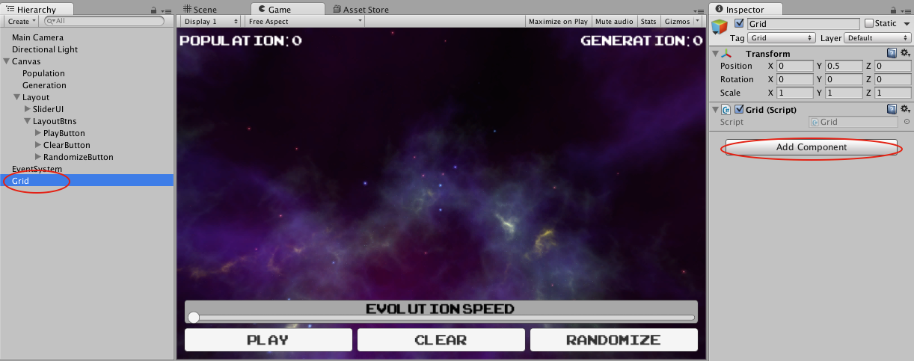
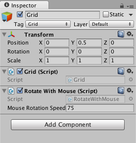

#3D

All the Ds. All of them.

Actually, making the game 3D isn’t terribly complicated. It just
involves giving our cells one more dimension and changing our rules to
work better, now that a Cell can be surrounded by 26 Cells instead of 8.

Let’s do it!

First, change the cells member variable to allow a third dimension by
changing it to be:

```
private Cell[,,] cells;
```

It may look very similar to before; we’ve just added a comma.

Next, add the follow member variable:

```
 private int numLays = 5;
```

We’re using the term “layers” to refer to this new dimension we’re
adding to our grid, hence “lay” for short.

Add this information to the instantiation of our multidimensional array
of cells by changing that line in the Start method to be:

```
cells = new Cell[numCols,numRows,numLays];
```

Nest a third for loop anywhere you have two and rename the variables as
appropriate. For example, in Start, you’d add:

```
 for (int lay = 0; lay < numLays; ++lay) {
```
under:

```
 for (int row = 0; row < numRows; ++row) {
```

Be sure to close each new for loop you add with a closing curly brace!

Anywhere you get a Cell using cells\[col,row\], change that to use your
third parameter. For example, in Start, that would change to
“cells\[col,row,lay\]”

Be sure that GetNumAliveNeighbors gets a third parameter added, that its
first continue conditional include information about the third
dimension, and that the third dimension is adjusted like the rest!

Either get rid of the code in Start that we were using to set an initial
condition, or else add an extra parameter to it.

Finally, change the positioning code that sets where the Cells are, in
the Start method to:

```
 float x = (col + 0.5f - numCols * 0.5f) * (cellSideLength + margin);

 float y = (row + 0.5f - numRows * 0.5f) * (cellSideLength + margin);

 float z = (lay + 0.5f - numLays * 0.5f) * (cellSideLength + margin);

 cell.transform.localPosition = new Vector3(x,y,z);
```

Note that we’ve changed from a Vector2 to a Vector3. This is actually
okay because localPoisition is *really* a Vector3. When we assigned from
a Vector2, Unity was smart and just filled in a 0 for that 3rd
parameter.

All right. You’ve made a lot of changes. Take a deep breath.

Save the component, run the Scene, and hit Randomize.


Did you get an error when you tried to run the Scene? If so,
double-click the error in the Console and it should take you to the spot
in your code that made Unity sad. See if you can figure out what the
issue is (a likely culprit is a missing curly brace). If you want help
though, of course ask staff! We’re here to help!

Before the Game of Life runs reasonably, we’ll want to adjust the rules
a little bit to be better suited for 3D.

Add the following member variables to Grid:
```
public int minStayAlive = 6;
public int maxStayAlive = 12;
public int minRevive = 5;
public int maxRevive = 8;
```
Then modify the conditional that determines life to be:

```
 if (cell.isAlive) {
if (numAliveNeighbors < minStayAlive || numAliveNeighbors > maxStayAlive) {
	cell.isAlive = false;
} else {
	cell.isAlive = true;
}
} else if (!cell.isAlive && numAliveNeighbors >= minStayAlive && numAliveNeighbors <= maxStayAlive) {
	cell.isAlive = true;
}
```
Save and run!


Now for the final touch. This last bit doesn’t involve writing any new
code, but interfacing a bit with Unity.

Click on Grid in the Hierarchy Panel on the left. You should see a panel
with information come up for it on the right in the Inspector.



Click on the Add Component button in the Inspector, type in the name
RotateWithMouse and hit enter. You should see a new component added in
the Inspector.




Now run the Scene and try dragging across the game space.


**3D!**

You may have noticed, by the way, that we made the min and max variables
for the 3D rules public rather than private. Why was this? Well, this is
a Unity thing. In Unity, public variables on a component are accessible
in the Editor. You can set their values there, or even change them
during runtime (they’ll go back to what they were when you stop the
Scene)!

Feel free to mess around with ‘em. Maybe you’ll find better settings
than the ones we picked!

Before you close the project, save the scene and project (File-&gt;Save
Scene, File-&gt;Save Project) so that the rotation component gets saved.
If you don’t your code will still be saved, at least.

Have fun watchin’ those 3D sims, and we hope you now feel more confident
in your C\# skills!
