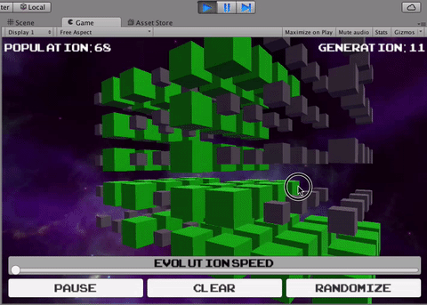

Before the Game of Life runs reasonably, we’ll want to adjust the rules
a little bit to be better suited for 3D.

>[action]
>Add the following member variables to Grid:
>```
>public int minStayAlive = 6;
>public int maxStayAlive = 12;
>public int minRevive = 5;
>public int maxRevive = 8;
>```
>
>Then modify the conditional that determines life to be:
>
>```
> if (cell.isAlive) {
>if (numAliveNeighbors < minStayAlive || numAliveNeighbors > maxStayAlive) {
>	cell.isAlive = false;
>} else {
>	cell.isAlive = true;
>}
>} else if (!cell.isAlive && numAliveNeighbors >= minStayAlive && numAliveNeighbors <= >maxStayAlive) {
>	cell.isAlive = true;
>}
>```

Save and run!


Now for the final touch. This last bit doesn’t involve writing any new
code, but interfacing a bit with Unity.

>[action]
>Click on Grid in the Hierarchy Panel on the left. You should see a panel
with information come up for it on the right in the Inspector.


>[action]
>Click on the Add Component button in the Inspector, type in the name
RotateWithMouse and hit enter. You should see a new component added in
the Inspector.


>[action]
>Now run the Scene and try dragging across the game space.



**3D!**

You may have noticed, by the way, that we made the min and max variables
for the 3D rules public rather than private. Why was this? Well, this is
a Unity thing. In Unity, public variables on a component are accessible
in the Editor. You can set their values there, or even change them
during runtime (they’ll go back to what they were when you stop the
Scene)!

Feel free to mess around with ‘em. Maybe you’ll find better settings
than the ones we picked!

Before you close the project, save the scene and project (File-&gt;Save
Scene, File-&gt;Save Project) so that the rotation component gets saved.
If you don’t your code will still be saved, at least.

Have fun watchin’ those 3D sims, and we hope you now feel more confident
in your C\# skills!
